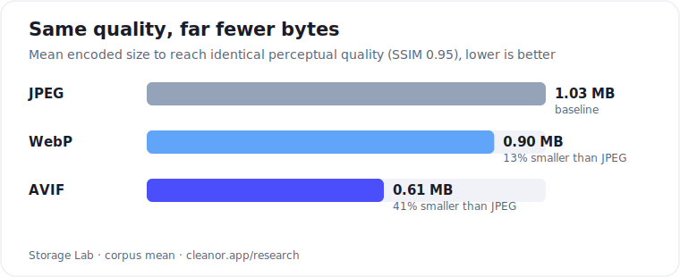
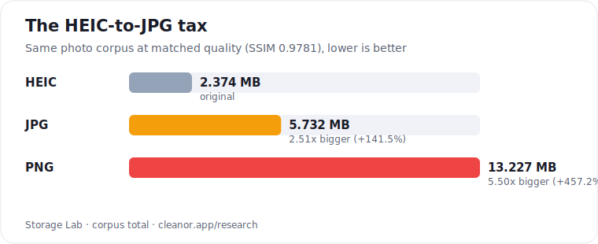

# Storage Lab: an open image compression benchmark (HEIC to JPG, WebP vs AVIF, JPEG XL)

**Reproducible, open image compression benchmarks: what HEIC to JPG really costs in bytes, and whether WebP, AVIF or JPEG XL is smallest at equal quality.**

Open datasets and the harness behind them, covering **image compression (JPEG / WebP / AVIF / JPEG XL), the HEIC-to-JPG size tax, video codecs (Xvid/DivX vs H.264 / HEVC / AV1 / VP9), cloud storage $/GB, and phone storage capacity.** Every number here is generated by a script in [`benchmarks/`](benchmarks/) that you can re-run yourself, on your own media, in one command.

[](LICENSE)
[](data/LICENSE)
[](https://cleanor.app/research)
[](https://doi.org/10.5281/zenodo.21217372)
[](https://huggingface.co/datasets/cleanorlabs/cleanor-storage-lab)
[](https://www.kaggle.com/datasets/cleanorlabs/image-conversions-tax)

> 📊 **Human-readable write-ups, with charts and methodology, live at [cleanor.app/research](https://cleanor.app/research).** This repo is the raw data and the harness behind them.

Maintained by [Cleanor Labs](https://cleanor.app/research). If a study is useful, please [cite it](#citation): that is the whole point of publishing the raw data.

## Key findings

Every figure below names the data file it came from. All image comparisons are at **matched perceptual quality (SSIM)**, so a smaller file is never just a worse-looking file.

- **Converting HEIC to JPG made every photo bigger, 24 out of 24, at every quality level tested.** The median photo grew **1.75x** from a high-quality HEIC and **4.65x** from a low-quality one, with no gain in SSIM. Source: [`data/heic-tax-summary.csv`](data/heic-tax-summary.csv) (`jpg_tax_x_median`), per-image rows in [`data/heic-tax-benchmark.csv`](data/heic-tax-benchmark.csv).
- **Converting HEIC to PNG is far worse: a median of 3.87x to 13.60x larger**, and up to **23.19x** for a single image, for zero perceptual benefit. Source: [`data/heic-tax-summary.csv`](data/heic-tax-summary.csv) (`png_tax_x_median`).
- **AVIF is the smallest format at every quality tier we measured.** At SSIM 0.95 it needs **640,546 bytes against JPEG's 1,077,997, i.e. 40.6% smaller** on a 12 MP photo corpus, and it is the smallest of four formats for **24 of 24** Kodak images. Sources: [`data/compression-benchmark-summary.csv`](data/compression-benchmark-summary.csv) (`iso_ssim_mean_bytes`), [`data/nextgen-formats-benchmark.csv`](data/nextgen-formats-benchmark.csv).
- **"WebP is always smaller than JPEG" is false at high quality.** At SSIM 0.98 WebP needs **1,776,876 bytes vs JPEG's 1,418,698 (25.2% bigger)**, and at SSIM 0.99 it is **57.1% bigger** than JPEG. Source: [`data/compression-benchmark-summary.csv`](data/compression-benchmark-summary.csv).
- **JPEG XL losslessly recompresses existing JPEGs by 8.3%** (2,258,640 to 2,071,974 bytes across 24 images, 6.1% to 10.6% each), bit-exact and fully reversible. Source: [`data/nextgen-formats-benchmark.csv`](data/nextgen-formats-benchmark.csv) (`jpeg_q90_bytes` vs `jxl_lossless_bytes`).
- **The Xvid/DivX video codec needs ~4x the bitrate of H.264 and ~8.9x that of AV1 at the same quality** (SSIM 0.97, three 720p clips). Re-encoding a Xvid file to HEVC cuts it to **18%** of its size, and to AV1, **11%**. The gap is widest at streaming quality and narrows toward visually-lossless. Sources: [`data/video-codec-summary.csv`](data/video-codec-summary.csv), per-encode ladder in [`data/video-codec-benchmark.csv`](data/video-codec-benchmark.csv).
- **A 3-second GIF is 44x to 91x bigger than the same clip as an MP4** (8-11 MB vs ~100-250 KB), and lower quality (256 colours). GIF has no interframe compression, so it pays full price for parts of the frame that never move. Source: [`data/gif-format-benchmark.csv`](data/gif-format-benchmark.csv).
- **The median popular iOS app is ~400 MB to download, and 9 of 40 exceed 500 MB** — TikTok 936 MB, Gmail 775 MB, and payment apps Venmo (676 MB) and PayPal (525 MB) outweigh Netflix, all before a single cache. Measured from the App Store, date-stamped. Source: [`data/app-size-index.csv`](data/app-size-index.csv).





<sub>Charts generated from the CSVs by [`benchmarks/render-charts.mjs`](benchmarks/render-charts.mjs). Full methodology and interactive versions at [cleanor.app/research](https://cleanor.app/research).</sub>

## Docs

| Doc | What it answers |
| --- | --- |
| [`docs/heic-to-jpg-size-tax.md`](docs/heic-to-jpg-size-tax.md) | Does converting HEIC to JPG make the file bigger? (Yes: median 1.75x to 4.65x, with the full table) |
| [`docs/webp-vs-avif-vs-jpeg-xl.md`](docs/webp-vs-avif-vs-jpeg-xl.md) | WebP vs AVIF vs JPEG XL: which format is actually smallest at equal SSIM? |
| [`docs/video-codec-size-benchmark.md`](docs/video-codec-size-benchmark.md) | How much smaller is H.265 / AV1 than Xvid/DivX at the same quality? (4x to 8.9x, with the per-clip table) |
| [`docs/app-size-index.md`](docs/app-size-index.md) | How big are the apps on your phone? Measured App Store download sizes (TikTok 936 MB) |
| [`docs/gif-vs-mp4-size.md`](docs/gif-vs-mp4-size.md) | Why is my GIF so big? GIF vs MP4/WebM (44x to 91x) |
| [`docs/methodology.md`](docs/methodology.md) | Corpus, encoders, the SSIM metric, and the honest caveats |
| [`docs/preprints/heic-conversion-file-size-tax.md`](docs/preprints/heic-conversion-file-size-tax.md) | The HEIC-tax study as a citable manuscript ([PDF](docs/preprints/heic-conversion-file-size-tax.pdf)) |
| [`docs/huggingface-dataset-card.md`](docs/huggingface-dataset-card.md) | The dataset card published to Hugging Face |
| [`docs/kaggle/README.md`](docs/kaggle/README.md) | How the Kaggle mirror is published |
| [`docs/kaggle/column-descriptions.md`](docs/kaggle/column-descriptions.md) | Column-by-column description of every CSV |

## Why this exists

Most "AVIF saves 50%" or "just convert HEIC to JPG" claims online cite each other, not a measurement. We publish the corpus-driven measurement **and the harness that produced it**, so anyone can verify, extend, or disagree with the method rather than the vibe.

The image benchmarks run on the classic **Kodak** suite and a **high-resolution phone-photo** corpus, encode with **libvips/sharp** (the same engine behind Cleanor's browser tools) and **libjxl / libheif**, and score perceptual quality with **SSIM + PSNR via ffmpeg** against the lossless master. Nothing is hand-tuned per image.

## The datasets

Every dataset ships with a plain-English write-up on the site and a reproducible script here.

| Dataset | Files | Read the study |
| --- | --- | --- |
| Image compression reality | [`compression-benchmark*.csv`](data/) | [JPEG vs WebP vs AVIF savings →](https://cleanor.app/blog/jpeg-webp-avif-photo-compression-savings-benchmark) |
| Next-gen formats (+ JPEG XL) | [`nextgen-formats-benchmark.csv`](data/nextgen-formats-benchmark.csv) | [AVIF · WebP · JPEG XL 2026 →](https://cleanor.app/blog/next-gen-image-formats-2026-avif-webp-jpeg-xl-benchmark) |
| The HEIC Tax | [`heic-tax-*.csv`](data/) | [What "heic to jpg" really costs →](https://cleanor.app/blog/heic-to-jpg-conversion-file-size-tax-benchmark) |
| Cloud storage price index | [`cloud-price-index.csv`](data/cloud-price-index.csv) | [What a gigabyte costs in 2026 →](https://cleanor.app/blog/cloud-storage-price-index-2026-what-a-gigabyte-costs) |
| Streaming data usage | [`streaming-data-usage.csv`](data/streaming-data-usage.csv) | [Data per hour by service →](https://cleanor.app/blog/how-much-data-does-streaming-use-per-hour-by-service) |
| Phone photo capacity | [`photo-storage-capacity.csv`](data/photo-storage-capacity.csv) | [How many photos fit on your phone →](https://cleanor.app/blog/how-many-photos-fit-in-your-phone-storage-capacity) |
| Passport photo specs | [`passport-photo-specs.csv`](data/passport-photo-specs.csv) | [Passport photo rules by country →](https://cleanor.app/blog/passport-photo-requirements-by-country-compared) |
| Storage search demand | [`storage-trends-*.csv`](data/) | [Storage anxiety by country →](https://cleanor.app/blog/storage-anxiety-by-country-search-data-2026) |

Highlights, pulled straight from those CSVs:

### 1. Image compression reality: JPEG vs WebP vs AVIF
📄 `data/compression-benchmark.csv` · `data/compression-benchmark-summary.csv` · 📖 [read the study](https://cleanor.app/blog/jpeg-webp-avif-photo-compression-savings-benchmark)

Mean bytes needed to reach the **same perceptual quality (SSIM)**, interpolated from a full quality ladder over the 12 MP photo corpus (`iso_ssim_mean_bytes` in `data/compression-benchmark-summary.csv`):

| Target quality | JPEG | WebP | AVIF | AVIF vs JPEG |
|---|---|---|---|---|
| SSIM 0.95 ("good") | 1,077,997 B | 938,691 B | **640,546 B** | **-40.6%** |
| SSIM 0.98 ("high") | 1,418,698 B | 1,776,876 B | **1,008,420 B** | **-28.9%** |
| SSIM 0.99 ("visually lossless") | 1,545,096 B | 2,426,853 B | **1,211,313 B** | **-21.6%** |

Takeaway: AVIF wins at every quality tier, and WebP is *worse than JPEG* above SSIM 0.98 on this corpus. Full analysis: [`docs/webp-vs-avif-vs-jpeg-xl.md`](docs/webp-vs-avif-vs-jpeg-xl.md).

### 2. State of next-gen formats: adding JPEG XL
📄 `data/nextgen-formats-benchmark.csv` · 📖 [read the study](https://cleanor.app/blog/next-gen-image-formats-2026-avif-webp-jpeg-xl-benchmark)

Adds **JPEG XL** to the matrix over the 24-image Kodak corpus. AVIF is smallest for 24 of 24 images at SSIM 0.95 (corpus total 1,170,077 B vs JPEG's 1,854,023 B, 36.9% smaller). JPEG XL's distinctive feature is **bit-exact lossless recompression of an existing JPEG** (`jxl_lossless_bytes` vs `jpeg_q90_bytes`), which shrank the corpus by **8.3%** (2,258,640 to 2,071,974 bytes) with zero quality loss and full reversibility.

### 3. The HEIC Tax: what "heic to jpg" really costs
📄 `data/heic-tax-benchmark.csv` · `data/heic-tax-summary.csv` · 📖 [read the study](https://cleanor.app/blog/heic-to-jpg-conversion-file-size-tax-benchmark)

Around 246,000 people a month Google "heic to jpg". Converting an iPhone-style HEIC to JPG at matched perceptual quality inflates the file with **no visible quality gain**:

| iPhone HEIC quality | Mean SSIM | JPG size tax (median) | PNG size tax (median) |
|---|---|---|---|
| High (`heic_q` 70) | 0.9866 | **1.75x larger** | 3.87x larger |
| Medium (`heic_q` 60) | 0.9781 | 2.51x larger | 5.50x larger |
| Low (`heic_q` 40) | 0.9314 | 4.65x larger | 13.60x larger |

Full analysis, including the per-image spread: [`docs/heic-to-jpg-size-tax.md`](docs/heic-to-jpg-size-tax.md).

### 4. Cloud storage price index
📄 `data/cloud-price-index.csv` · 📖 [read the study](https://cleanor.app/blog/cloud-storage-price-index-2026-what-a-gigabyte-costs)

$/GB/month and the 10-year "storage rent" across Apple iCloud+, Google One, Microsoft 365, Dropbox, Amazon, Proton Drive and Box (US consumer list prices captured 2026-07). Includes the **small-tier penalty**: iCloud's 50 GB tier costs **$0.0198/GB/month against $0.0050 for its 2 TB tier, 3.96x more per gigabyte** (`data/cloud-price-index.csv`, `usd_per_gb_month`).

### 5. Supporting reference datasets
- `data/streaming-data-usage.csv`: MB/hour for Netflix, YouTube, Disney+, TikTok, etc. (official + measured) · [study](https://cleanor.app/blog/how-much-data-does-streaming-use-per-hour-by-service)
- `data/photo-storage-capacity.csv`: how many HEIC / JPEG / 48 MP / ProRAW photos fit in each iPhone tier · [study](https://cleanor.app/blog/how-many-photos-fit-in-your-phone-storage-capacity)
- `data/passport-photo-specs.csv`: passport/visa photo specs (mm, head size, background, digital limits) by country · [study](https://cleanor.app/blog/passport-photo-requirements-by-country-compared)
- `data/storage-trends-*.csv`: search demand for storage-cleanup queries by country and month · [study](https://cleanor.app/blog/storage-anxiety-by-country-search-data-2026)

## Reproduce it yourself

```bash
git clone https://github.com/cleanor-app/cleanor-storage-lab.git
cd cleanor-storage-lab
npm install                      # installs sharp

# Drop your own .png/.tif/.jpg masters here:
mkdir -p corpus && cp /path/to/your/images/*.png corpus/

# Run any study (writes to data/):
node benchmarks/compression-benchmark.mjs
node benchmarks/nextgen-formats-benchmark.mjs
node benchmarks/heic-tax-benchmark.mjs
node benchmarks/cloud-price-index.mjs     # no corpus needed
```

**System dependencies** (macOS `brew`, Linux `apt`):
- `ffmpeg` for SSIM/PSNR scoring (all image studies)
- `libheif` (`heif-enc`, `heif-convert`) for the HEIC study
- `jpeg-xl` (`cjxl`, `djxl`) for the next-gen study

`sharp` (libvips) is installed by `npm install`. See [`docs/methodology.md`](docs/methodology.md) for the exact method, corpus, and caveats.

## Column reference (image benchmarks)

`image, width, height, pixels, format, quality, bytes, bpp, ssim, psnr`
where `ssim`/`psnr` are measured against the lossless master and `bpp` is bits-per-pixel. Higher SSIM/PSNR means closer to the original. Every column of every CSV is described in [`docs/kaggle/column-descriptions.md`](docs/kaggle/column-descriptions.md).

## FAQ

### Does converting HEIC to JPG make the file bigger?

Yes. In this benchmark it made the file bigger for **every image in the corpus, 24 out of 24, at every HEIC quality level tested**. The median photo grew **1.75x** from a high-quality HEIC and up to **4.65x** from a low-quality one, at matched perceptual quality, so the extra bytes buy nothing ([`data/heic-tax-summary.csv`](data/heic-tax-summary.csv)). HEIC uses HEVC intra-coding; JPEG has to spend more bytes to reproduce the same picture.

### Is converting HEIC to PNG a good idea?

No, not for photographs. PNG is lossless, so it faithfully preserves the HEIC's compression artefacts at lossless cost: a median of **3.87x to 13.60x larger**, and **23.19x** in the worst single case, with no perceptual gain ([`data/heic-tax-summary.csv`](data/heic-tax-summary.csv), [`data/heic-tax-benchmark.csv`](data/heic-tax-benchmark.csv)).

### Is AVIF really smaller than WebP and JPEG?

Yes, at every quality tier measured here. At SSIM 0.95, AVIF needs **640,546 bytes vs JPEG's 1,077,997 (40.6% smaller) and WebP's 938,691** on the 12 MP corpus ([`data/compression-benchmark-summary.csv`](data/compression-benchmark-summary.csv)). On the Kodak corpus, AVIF is the smallest of JPEG/WebP/AVIF/JPEG XL for **24 of 24** images at SSIM 0.95 and 21 of 24 at SSIM 0.98 ([`data/nextgen-formats-benchmark.csv`](data/nextgen-formats-benchmark.csv)).

### Is WebP always smaller than JPEG?

No. That folklore breaks at high quality. At SSIM 0.98, WebP needs **1,776,876 bytes against JPEG's 1,418,698 (25.2% bigger)**, and at SSIM 0.99 it is **57.1% bigger** ([`data/compression-benchmark-summary.csv`](data/compression-benchmark-summary.csv)). The crossover point is corpus dependent: on the smaller Kodak images WebP still beat JPEG at SSIM 0.98 by 6.1% ([`data/nextgen-formats-benchmark.csv`](data/nextgen-formats-benchmark.csv)).

### How much does JPEG XL shrink an existing JPEG?

**8.3%**, losslessly and reversibly, in this benchmark: 24 q90 JPEGs went from 2,258,640 to 2,071,974 bytes, every one of them smaller, by 6.1% to 10.6% each ([`data/nextgen-formats-benchmark.csv`](data/nextgen-formats-benchmark.csv)). The original JPEG can be reconstructed byte for byte, so the saving is free.

### How is "the same quality" defined?

By **SSIM** (structural similarity) against the lossless master, computed with `ffmpeg`, with PSNR as a secondary check. Formats are compared at matched SSIM (0.95 / 0.98 / 0.99), not at matched quality-slider values, because `q=80` means something different in every codec. SSIM is a good cheap proxy, not a human eye; see [`docs/methodology.md`](docs/methodology.md) for that and the other caveats.

### Can I run these benchmarks on my own photos?

Yes, that is the point. Drop lossless masters into `corpus/` and run any script in [`benchmarks/`](benchmarks/). Your absolute byte counts will differ with your corpus; the relative ordering of the formats is what generalizes.

## Related projects

Sibling repositories from Cleanor Labs, all open source:

| Repo | What it is |
| --- | --- |
| [browser-image-tools](https://github.com/cleanor-app/browser-image-tools) | The client-side image compression/conversion engine, images never leave the device |
| [cleanor-mcp](https://github.com/cleanor-app/cleanor-mcp) | MCP server giving AI assistants image optimization and this repo's storage data |
| [search-index](https://github.com/cleanor-app/search-index) | Open monthly search-demand studies, the source behind the `storage-trends-*` data |
| [image-compressor-chrome-extension](https://github.com/cleanor-app/image-compressor-chrome-extension) | Chrome extension: compress and convert images (HEIC/AVIF/WebP) in the browser |
| [wordpress-image-optimizer](https://github.com/cleanor-app/wordpress-image-optimizer) | WordPress plugin: bulk image compression and WebP/AVIF conversion |

## Contributing

Issues and PRs welcome, especially:
- running the harness on a different corpus and sharing the resulting CSV,
- adding an encoder/format to a benchmark,
- correcting a cloud price (edit the `PLANS` table in `benchmarks/cloud-price-index.mjs` and re-run).

Please keep data and code changes in separate commits, and note your corpus/encoder versions so results stay reproducible.

## Citation

If you use these datasets or figures, cite:

> Cleanor Labs, *Storage Lab: Open Image-Compression & Cloud-Storage Datasets*, 2026. Zenodo. https://doi.org/10.5281/zenodo.21217372

A [`CITATION.cff`](CITATION.cff) is included for GitHub's "Cite this repository" button (author [ORCID 0009-0005-4623-961X](https://orcid.org/0009-0005-4623-961X)). Two citable DOIs are available:

- **Zenodo** (this repository): [10.5281/zenodo.21217372](https://doi.org/10.5281/zenodo.21217372)
- **Kaggle** (dataset mirror): [10.34740/kaggle/dsv/17715917](https://doi.org/10.34740/kaggle/dsv/17715917), [kaggle.com/datasets/cleanorlabs/image-conversions-tax](https://www.kaggle.com/datasets/cleanorlabs/image-conversions-tax)

Full write-ups: **https://cleanor.app/research**.

**Preprint:** the HEIC-tax study is written up as a manuscript, [`docs/preprints/heic-conversion-file-size-tax.md`](docs/preprints/heic-conversion-file-size-tax.md) ([PDF](docs/preprints/heic-conversion-file-size-tax.pdf)).

## License

- **Code** (`benchmarks/`): [MIT](LICENSE)
- **Data** (`data/`): [CC BY 4.0](data/LICENSE), free to use, including commercially, **with attribution** to Cleanor Labs.
